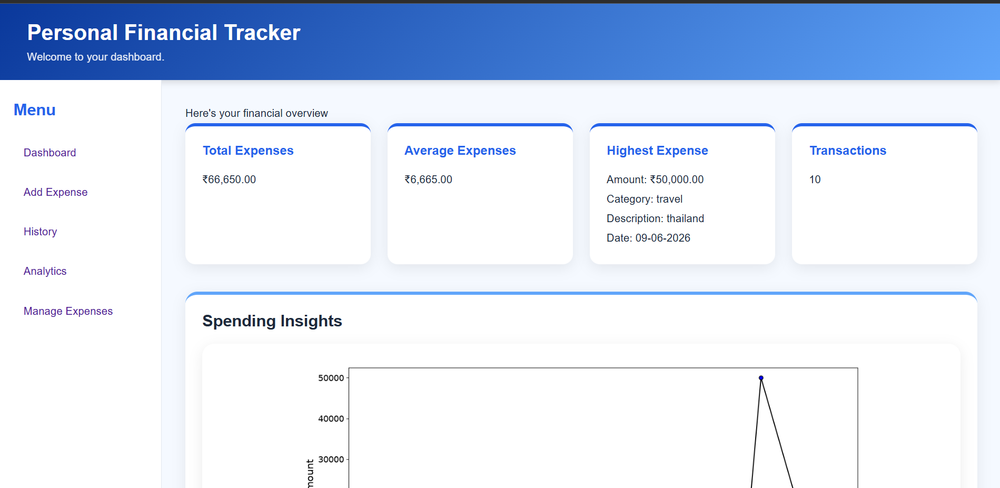
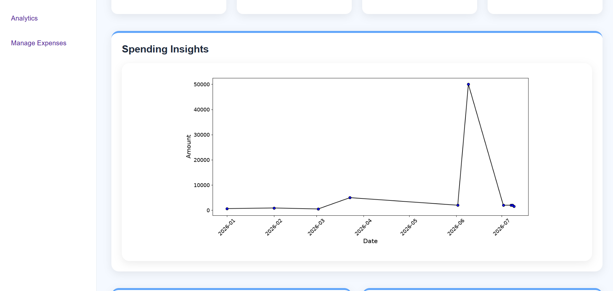
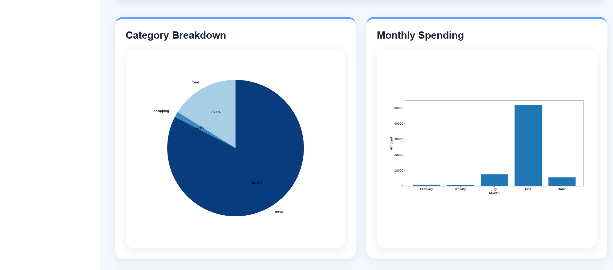
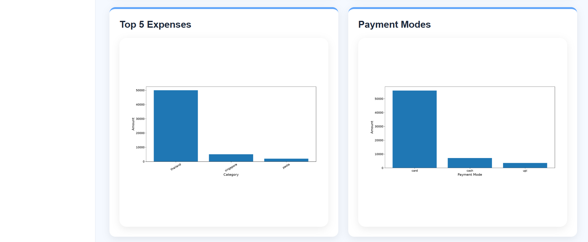
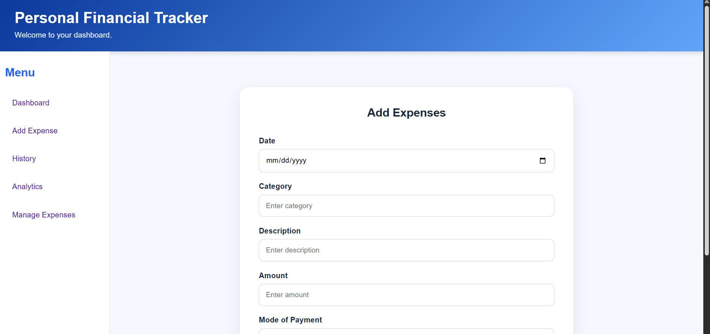
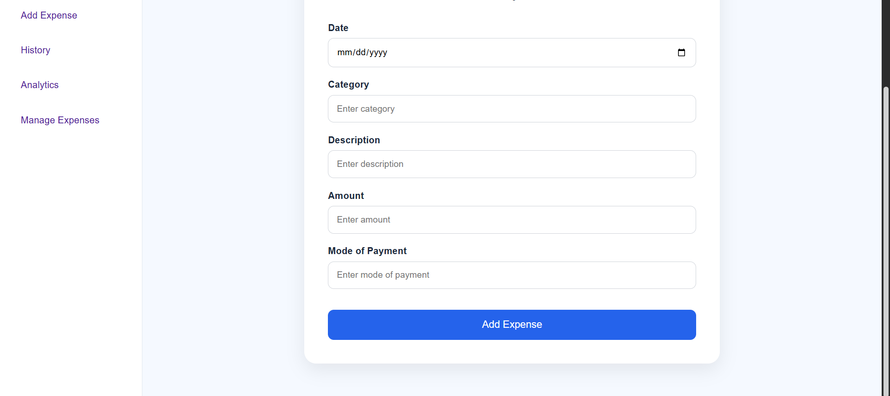
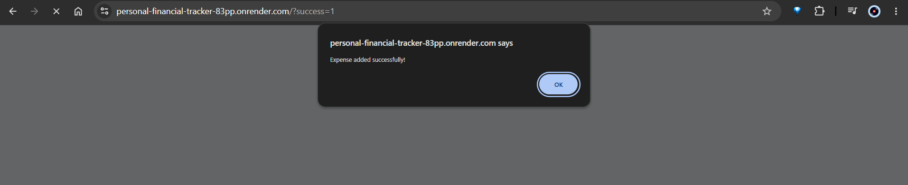
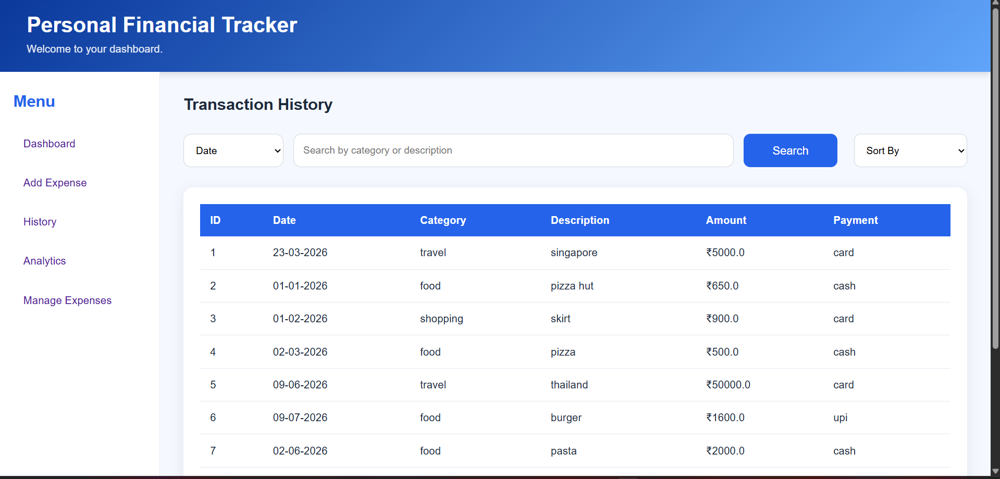
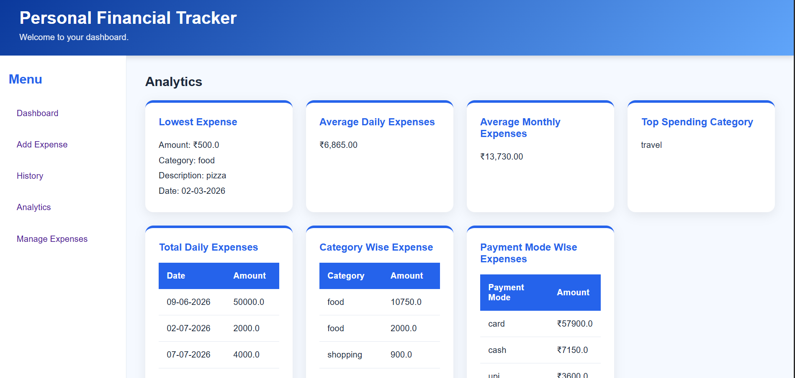
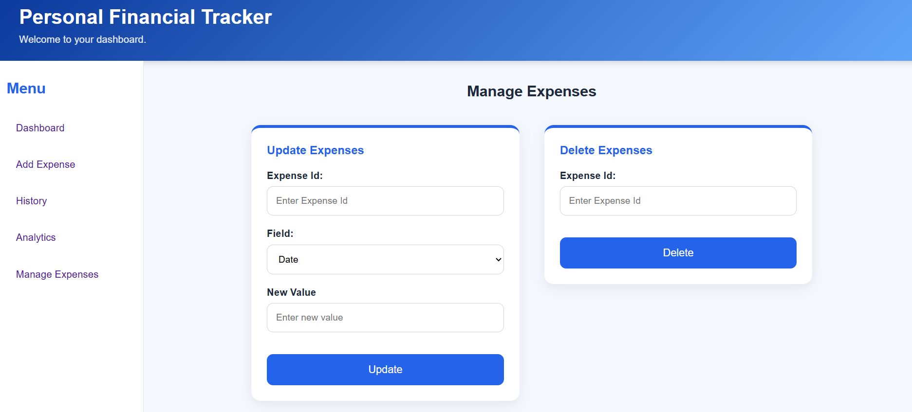

# 💰 Personal Finance Tracker

A modern web-based **Personal Finance Tracker** built using **Flask**, **Python**, **HTML** and **CSS**. The application helps users efficiently manage their daily expenses, analyze spending habits, and visualize financial data through an interactive dashboard.

---

## 🌐 Live Demo

🔗 https://personal-financial-tracker-83pp.onrender.com/

> **Note:** The current version uses CSV files for storage. Since the application is deployed on Render's free tier, data entered on the live website is temporary and may reset after the service restarts. A future update will migrate the project to SQLite for persistent storage.

---

## ✨ Features

### 📊 Dashboard
- View total expenses
- View total number of transactions
- Average expense calculation
- Highest expense summary
- Interactive charts and graphs

### 💳 Expense Management
- Add new expenses
- Edit existing expenses
- Delete expenses
- View complete transaction history

### 🔍 Search & Filter
- Search by:
  - Date
  - Category
  - Description
  - Payment Mode

### 📈 Analytics
- Highest expense
- Lowest expense
- Average expense
- Average daily spending
- Average monthly spending
- Category-wise spending
- Payment mode analysis
- Top spending category

### 📉 Visualizations
- Daily Expense Line Graph
- Monthly Expense Bar Chart
- Category-wise Pie Chart
- Payment Mode Bar Chart
- Top Expenses Chart

### 🎨 User Interface
- Clean and modern design
- Responsive layout for desktop, tablet, and mobile devices
- Sidebar navigation
- Interactive cards
- Smooth hover effects

---

## 🛠️ Tech Stack

### Frontend
- HTML5
- CSS3

### Backend
- Python
- Flask

### Data Processing
- Pandas
- NumPy

### Data Visualization
- Matplotlib

### Data Storage
- CSV Files

### Deployment
- Render

### Version Control
- Git
- GitHub

---

## 📂 Project Structure

```text
Personal-Finance-Tracker/
│
├── app.py
├── requirements.txt
├── README.md
│
├── data/
│   └── expenses.csv
│
├── static/
│   ├── css/
│   │   └── style.css
│   │
│   └── images/
│       ├── dashboard1.png
│       ├── dashboard2.png
│       ├── dashboard3.png
│       ├── dashboard4.png
│       ├── addexpenses1.png
│       ├── addexpenses2.png
│       ├── addexpenses3.png
│       ├── analytics.png
│       ├── history.png
│       └── manageexpenses.png
│
├── templates/
│   ├── index.html
│   ├── add_expense.html
│   ├── history.html
│   ├── analytics.html
│   └── manage_expenses.html
│
└── utils/
    ├── analysis.py
    ├── expenses_manager.py
    └── visualization.py

```

---

## 📸 Screenshots

### Dashboard









---

### Add Expense







---

### Transaction History



---

### Analytics



---

### Manage Expenses



---

## 🚀 Getting Started

### Clone the repository

```bash
git clone https://github.com/Urvi1408/Personal-Finance-Tracker.git
```

### Navigate to the project

```bash
cd Personal-Finance-Tracker
```

### Create a virtual environment (Recommended)

**Windows**

```bash
python -m venv venv
venv\Scripts\activate
```

**Linux/macOS**

```bash
python3 -m venv venv
source venv/bin/activate
```

### Install dependencies

```bash
pip install -r requirements.txt
```

### Run the application

```bash
python app.py
```

Visit:

```
http://127.0.0.1:5000
```

---

## 📊 Project Highlights

✔ CRUD Operations

✔ Data Analysis using Pandas

✔ Interactive Graphs

✔ Responsive UI

✔ Flask Routing

✔ CSV File Handling

✔ Search & Sorting

✔ Expense Analytics

✔ Web Deployment

---

## 📌 Future Improvements

- SQLite integration
- User Authentication
- Budget Planning
- Monthly Budget Goals
- Expense Categories Management
- Export Reports (PDF/Excel)
- Recurring Expenses
- Email Notifications
- Dark Mode
- Multi-user Support

---

## 🤝 Contributing

Contributions, suggestions, and improvements are welcome.

1. Fork the repository.
2. Create a feature branch.

```bash
git checkout -b feature-name
```

3. Commit your changes.

```bash
git commit -m "Added new feature"
```

4. Push the branch.

```bash
git push origin feature-name
```

5. Open a Pull Request.

---

## 👩‍💻 Author

**Urvi Mullick**

GitHub: https://github.com/Urvi1408

Portfolio: https://urvi1408.github.io/
